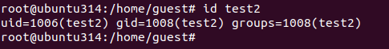
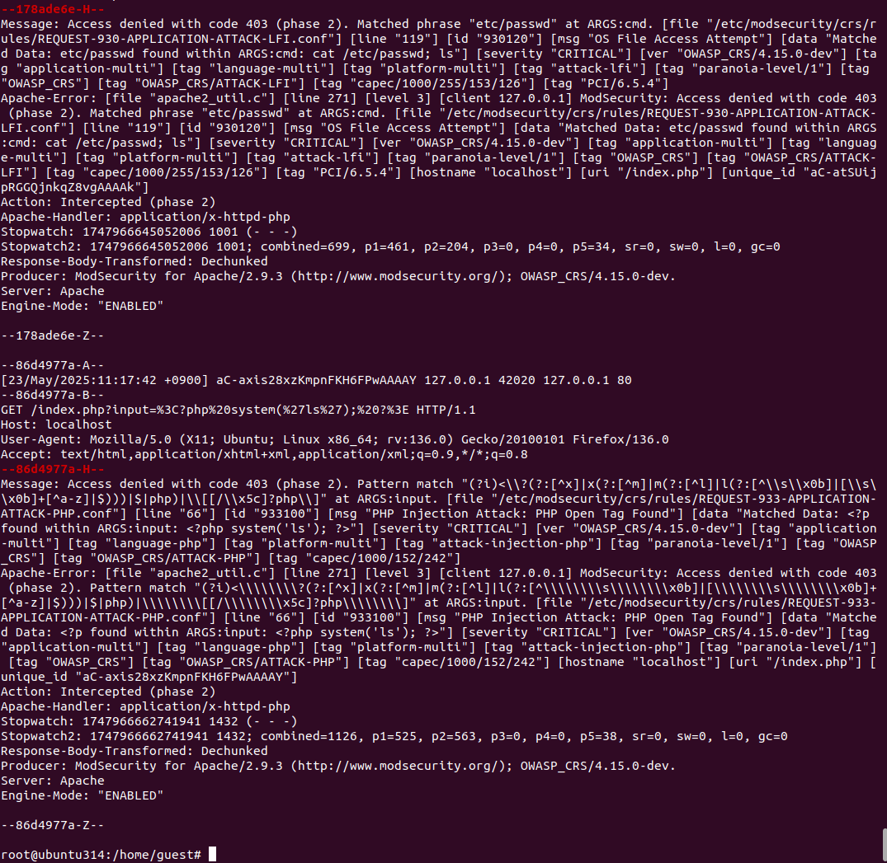

# linux_log_20180968
리눅스 로그용

# 3주차

1. 현재 사용자 홈디렉터리의 폴더 목록을 list.txt로 리다이렉션 하시오.

2. /를 대상으로 하루(1일)이내 변경된 모든 파일 검색하기.

3. 특정 설정 파일(game_config.xml)을 검색하기

4. 하드 링크와 심볼릭 링크의 차이점을 설명하라.
하드링크는 파일 내용을 직접 공유하지만 심볼릭 링크는 파일 경로만 참조합니다.

5. /root의 alias 이름을 포함하는 파일명과 행번호를 출력하시오.

# 4주차

adduser 명령어로 홈 디렉터리를 지정하여 test 사용자를 생성하시오.
useradd와 다르다. 홈 관련 옵션? (man adduser)로 확인

Test 사용자의 패스워드를 지정과 함께 최소일 7일, 최대일 10일로 설정하시오.
chage로 확인 및 설정

현재 test 사용자의 gid 그룹은 무엇인가?향 
id로 확인

gid 3000번 new 그룹, 3005번 old 그룹을 2개 생성하시오.
/etc/group (그룹 확인)
사용자 test의 주 그룹으로 new, 보조 그룹으로 old를 추가하시오.
id로 확인 - 기존 그룹이 존재하는 경우 new로 다시 변경

# 5주차

현재 umask 기본값은 022다. 폴더 및 디렉터리의 생성 시 권한을 750 (rwx, r-x, ---) 로 변경하고 싶다. 기본 umask값은 몇으로 변경해야 하는가?
웹 사이트 활용 값 확인
직접 umask 명령으로 권한 변경 후 파일 생성 확인

홈 디렉터리에 임시 파일 temp.txt를 생성한다.
파일의 소유자, 그룹 권한을 root:root 로 변경하시오. 
파일의 허가 권한을 700으로 수정한다.

temp.txt에 특수권한을 추가한다.
setuid를 추가 설정후 stat로 파일 확인

파일 속성을 읽기/쓰기까지 가능하고 삭제만 되지 않도록 속성을 수정하시오.

# 6주차

좀비 프로세스를 출력, 개수 확인(파일 : zombie2.sh로 저장 후 실행)
Wc는 문자 개수 카운트
업로드된 zombie_process2.sh를 먼저 실행

시스템 메모리 양이 1GB 이상 프로세스 모든 정보를 출력
grep 프로세스 제외, 숫자 기준 내림차순 검색
ps -ef | grep -v grep | sort -nr | awk '{ if ($2 >= 1048576) print $0 }’

다음 중 프로세스에 관련된 설명으로 알맞은 것은?  
최초의 프로세스인 init은 PID 번호가 1이다.  
리눅스 부팅 시에 발생하는 프로세스는 exec 방식이다.  
리눅스는 다중 프로세스를 지원하지 않는다.  
새로운 프로세스를 만들 때 기존 프로세스를 일부 변경한다.  
👉 정답: ① 최초의 프로세스인 init은 PID 번호가 1이다.  

다음 명령어는 어떤 유형인가? (find / -name -type d 2>/dev/null > dir.txt &)  
포그라운드 프로세스  
백그라운드 프로세스  
좀비 프로세스  
데몬 프로세스  
👉 정답: 백그라운드 프로세스  

그림과 같이 실시간 프로세스를 출력하는 명령어는?  
ps  
pstree  
jobs  
top  
👉 정답: top  

서버의 주요 서비스 등록 처리를 수행하는 프로세스는?  
포그라운드 프로세스  
백그라운드 프로세스  
좀비 프로세스  
데몬 프로세스  
👉 정답: 데몬 프로세스  

# 7주차

현재 깃허브 업로드는 업로드 할 때마다 아이디, 패스워드(토큰)을 입력 해야한다. 원격 주소를 수정하여 자동 로그인(입력)되도록 수정한다.
힌트 : git remote set-url origin 명령어를 찾아 원격 주소를 수정한다.

깃허브 업로드 스크립트를 부팅할 때 자동으로 1번 실행되도록 자동 스케쥴러에 등록한다. (crontab 활용)
힌트 : crontab –e 에서 현재 깃허브 업로드 스크립트를 등록한다.

# 9주차

간략 문제 풀기 – RAID 설정

# 11주차

워드프레스 보안 실습을 수행하고 스크린샷 하시오.

1. 사용자 및 로그인 문제 해결

2. 방화벽 문제 해결

Crontab에 자동화

취약점 스캔 결과와 해결방안

1. Cross Site Scripting (DOM Based) (63건)
취약점 개요:
DOM 기반 XSS는 클라이언트 측 자바스크립트가 사용자 입력을 적절히 검증하지 않고 HTML에 삽입할 때 발생합니다.

해결 방안:

클라이언트 측에서 사용자 입력을 DOM에 삽입하기 전에 반드시 이스케이프 처리(Escape) 또는 인코딩 적용

신뢰할 수 없는 데이터를 innerHTML 대신 textContent, setAttribute 등 안전한 API로 처리

Content Security Policy (CSP)를 도입하여 인라인 스크립트 실행 제한

가능한 경우 DOMPurify 같은 라이브러리를 사용해 입력값을 정제

2. Cross Site Scripting (Reflected) (3건)
취약점 개요:
서버가 사용자 입력을 그대로 반영해 HTML 페이지에 삽입할 때 발생하는 XSS.

해결 방안:

서버 측에서 입력값에 대한 철저한 필터링 및 이스케이프 처리 적용

HTML 출력 시 특수문자(<, >, ", ', &)를 반드시 인코딩

사용자 입력을 URL 쿼리, HTML, 자바스크립트 등에 직접 삽입하지 않도록 주의

CSP 설정 강화

3. Absence of Anti-CSRF Tokens (3건)
취약점 개요:
사이트 간 요청 위조(CSRF)를 방지하기 위한 토큰이 없으면 공격자가 사용자의 권한으로 악의적 요청을 보낼 수 있음.

해결 방안:

모든 상태 변경 요청(POST, PUT, DELETE 등)에 CSRF 토큰 적용

토큰은 서버가 생성하여 폼 및 AJAX 요청에 포함

토큰 검증 실패 시 요청 차단

SameSite 쿠키 속성 설정 권장

4. Content Security Policy (CSP) Header Not Set (181건)
취약점 개요:
웹 애플리케이션에 CSP 헤더가 없으면 XSS, 데이터 인젝션 공격 등에 취약해짐.

해결 방안:

HTTP 응답 헤더에 Content-Security-Policy 추가

기본적으로 신뢰할 수 있는 스크립트, 스타일, 이미지 소스만 허용하도록 설정

default-src 'self' 와 같이 엄격한 정책 적용 권장

점진적으로 정책 강화하며 테스트 진행

5. Missing Anti-clickjacking Header (74건)
취약점 개요:
X-Frame-Options 또는 CSP의 frame-ancestors 헤더가 없으면, 다른 사이트가 해당 페이지를 iframe에 삽입해 클릭재킹 공격 가능.

해결 방안:

HTTP 응답 헤더에 X-Frame-Options: DENY 또는 SAMEORIGIN 추가

또는 CSP의 frame-ancestors 'none' 또는 신뢰할 도메인만 허용 설정

클릭재킹 방어를 위한 헤더 반드시 적용

# 0523 아파치 웹서버 보안 실습 

아래는 아파치 웹서버 보안 관련 스크린샷들입니다.

## 요약

# 0530 13주차 시스템 모니터링 실습습

